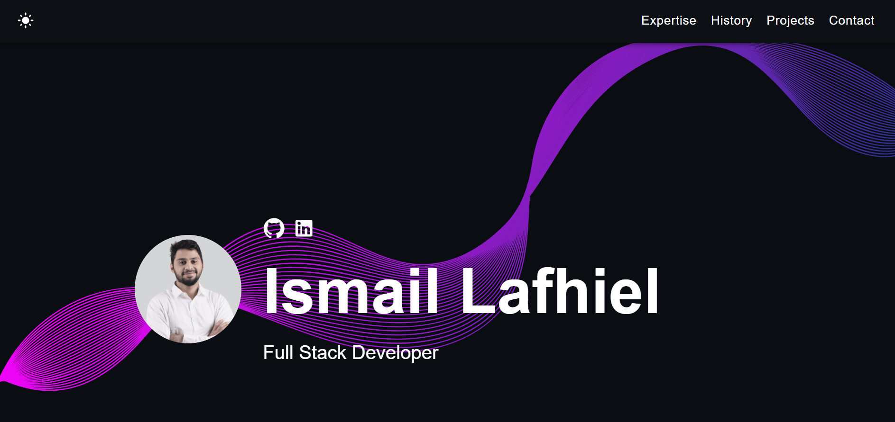

# Developer Portfolio Template 🚀

      

## What is this?

This simple portfolio template is designed to showcase my past projects, career history, skill sets, and more.

View the [Demo](https://yujisatojr.github.io/react-portfolio-template/).




## Features

✅ Responsive design & mobile-friendly  
✅ Supports both dark and light modes  
✅ Built with modern technologies (React, TypeScript, JavaScript, and SCSS)  

## Quick Setup

1. Ensure you have [Node.js](https://nodejs.org/) installed. Check your installation by running:

    ```bash
    node -v
    ```

2. In the project directory, install dependencies:

    ```bash
    npm install
    ```

3. Start the development server:

    ```bash
    npm start
    ```

4. Open [http://localhost:3000](http://localhost:3000) to view the app in the browser.